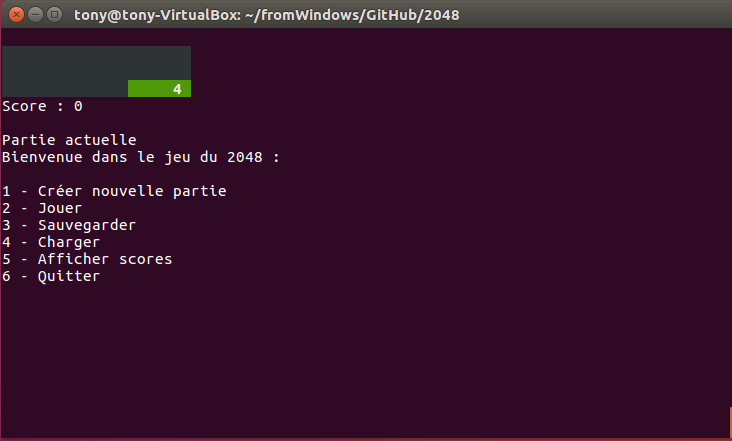
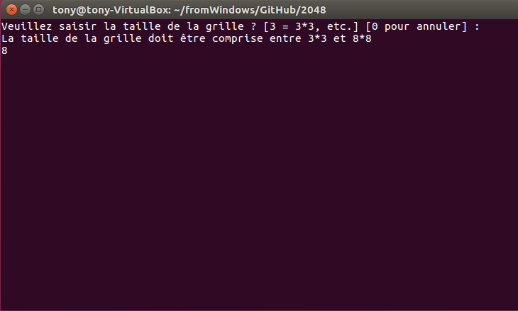
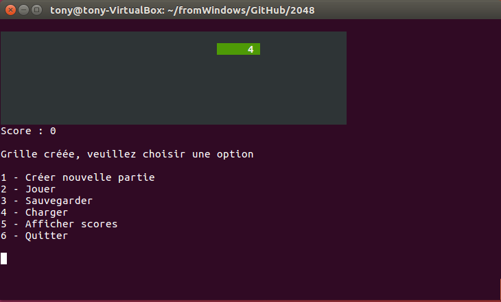
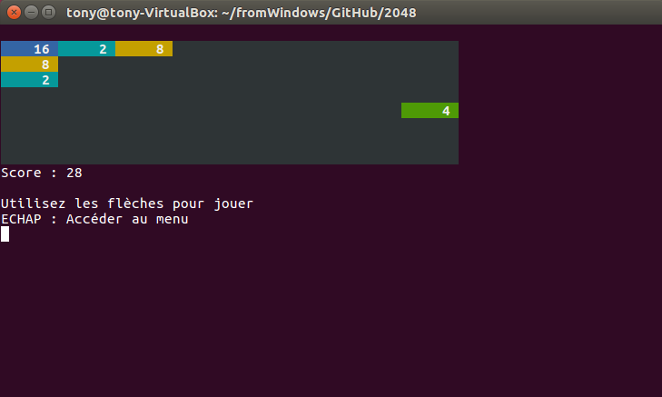
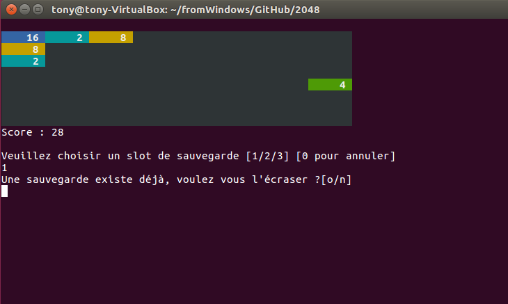
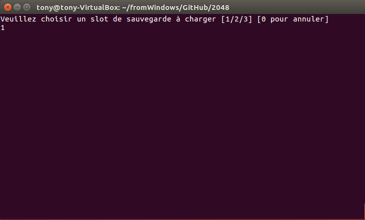
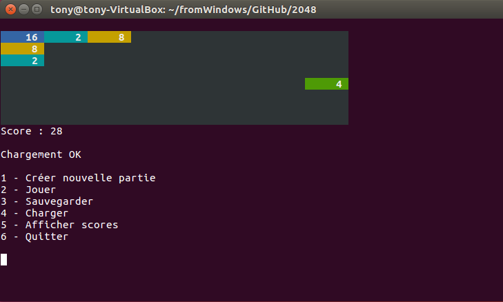
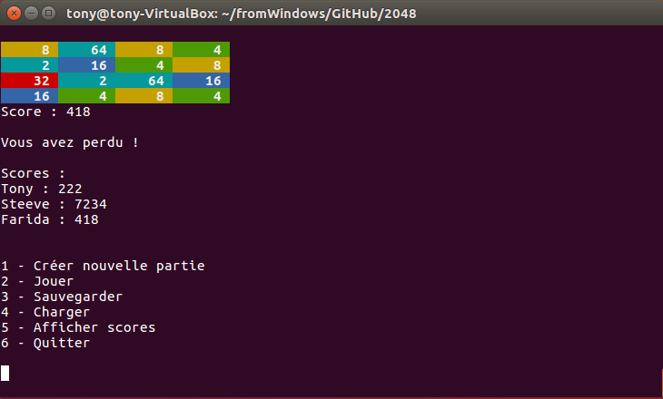

#### Auteur : *Tony Clonier*

## 1 - Règles du jeu :
 

Le gameplay du jeu repose sur l'utilisation des touches fléchées du clavier d’ordinateur pour déplacer les tuiles vers la gauche, la droite, le haut ou le bas. 
Lors d'un mouvement, l'ensemble des tuiles du plateau sont déplacés dans la même direction jusqu'à rencontrer les bords du plateau ou une autre tuile sur leur chemin. 
Si deux tuiles, ayant le même nombre, entrent en collision durant le mouvement, elles fusionnent en une nouvelle tuile de valeur double (par ex. : deux tuiles de valeur « 2 » donnent une tuile de valeur « 4 »). 
À chaque mouvement, une tuile portant un 2 ou un 4 apparaît dans une case vide de manière aléatoire.

Le jeu, simple au début, se complexifie de plus en plus, du fait du manque de place pour faire bouger les tuiles, et des erreurs de manipulation possibles, pouvant entraîner un blocage des tuiles et donc la fin du jeu à plus ou moins long terme, selon l’habileté du joueur. 
La partie est gagnée lorsqu'une tuile portant la valeur « 2048 » apparaît sur la grille, d'où le nom du jeu.

#### Source :
<https://fr.wikipedia.org/wiki/2048_(jeu_vidéo)>

## 2 - Lancement du jeu :
 

 Lors du lancement du jeu, le menu s'ouvre et une nouvelle partie est automatiquement initialisée. 
La partie en cours est affichée en permanence dans le terminal pour aider l'utilisateur à se repérer lors des différents enregistrements/chargements de parties.

 

## 3 - Menu
### 3.1. - Créer une nouvelle partie
 

 Dans le menu, appuyez sur la touche 1 pour créer une nouvelle partie.
Lors de la création d'une nouvelle partie, l'utilisateur peut choisir la taille de la grille sur laquelle il souhaite jouer.
La taille de la grille doit être comprise entre 3*3 et 8*8.

 

 

 

### 3.2. - Jouer
 

 Dans le menu, appuyez sur la touche 2 pour jouer à une partie (créée ou chargée).
Les tuiles doivent être déplacées à partir des flèches multidirectionnelles du clavier.
Il est possible d'appuyer sur la touche ECHAP pour retourner dans le menu.
Une fois la partie perdue ou gagnée, il est possible d'enregistrer son score.

 

 

### 3.3. - Sauvegarder
 

 Dans le menu, appuyez sur la touche 3 pour sauvegarder la partie en cours.
Il y a 3 slots de sauvegarde disponibles. Si un slot est déjà utilisé, le jeu demande l'autorisation à l'utilisateur d'écraser la sauvegarde précédente

 

 

### 3.4. - Charger
 

 Dans le menu, appuyez sur la touche 4 pour charger une partie.
Si le slot à charger est vide, l'utilisateur en est averti.

 

 

 

### 3.5. - Afficher scores
 

 Dans le menu, appuyez sur la touche 5 pour afficher les scores des joueurs.

 

 

### 3.6. - Quitter
 

 Appuyer sur la touche 6 pour quitter le jeu.

 

